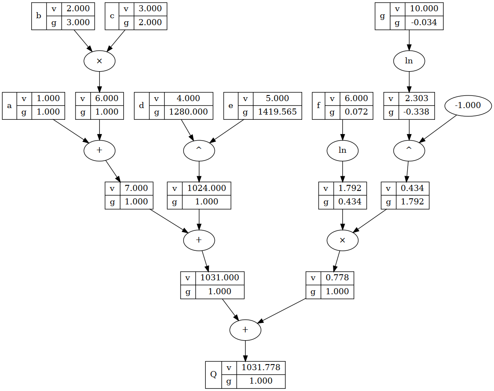

# Torch

Basic implementation for the main modules of PyTorch. For educational purposes only. 

## Setup

It's recommended to create a dedicated conda environment for this project.

```bash
(torch) $ sudo apt install libgraphviz-dev graphviz

(torch) $ pip install -r requirements.txt
```

## Training a Sample Model

`main.py` contains an example of using the built modules to solve the logical AND gate problem. The model is a single neuron with sigmoid activation function.

```bash
$ python main.py

X = [0.0, 0.0], y_p = 0.0006123178950711394, y = 0.0
X = [0.0, 1.0], y_p = 0.07379362759003869, y = 0.0
X = [1.0, 0.0], y_p = 0.07379362759003869, y = 0.0
X = [1.0, 1.0], y_p = 0.911975431040061, y = 1.0

```

## Visualizing the Computational Graph

`visualize.py` contains an example of visualizing the computational graph of the following equation:

$$Q = a + b \cdot c + d ^ e + \log_{10}(f)$$



# TODO

- [x] Implement `autograd` module to support arithmetic operations on scalars.
- [x] Simple implementation of `optim` and `nn` modules.
- [x] Visualizing the computational graph.
- [ ] N-dimensional arrays (Tensors) instead of scalars.
- [ ] Add Tensor operations.
- [ ] Implement `nn` module and `optim` to support Tensors and N-dimensional inputs.

# Note

The entire codebase has been written using vanilla VIM, with no plugins, no configurations, no Intellisense, no code completion, and no Copilot. The project was developed without any direct access to any of the existing `autograd` implementations (`pytorch`, `tinygrad`, `micrograd`, etc.), except for PyTorch API which the project is trying to re-implement. More importantly, only official documentation and forums (like Stackoverflow and Reddit) are allowed to be accessed while developing the project, and only for specific technical questions (i.e., questions that are not directly related to `autograd` implementation). ChatGPT or any other AI tool is prohibited.

This method turned out to be very helpful. It forces you to think and learn more. You'll be surprised by how much you can code without searching for anything or accessing any external documentation/forum.
